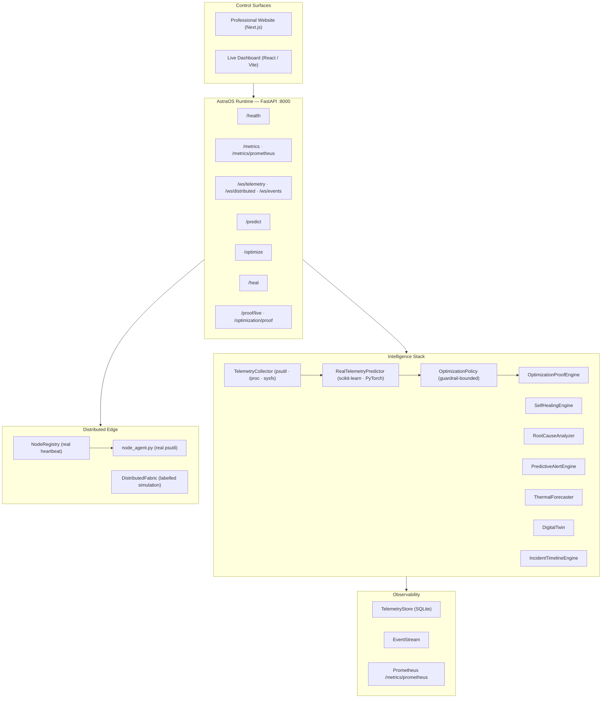

# AstraOS
### Predictive Runtime Intelligence & Autonomous Optimization for Modern Compute Systems

> **Predict → Decide → Optimize → Verify**
>
> A runtime intelligence platform that observes compute workloads, forecasts emerging resource pressure, recommends or applies optimization policies, and verifies their measurable impact across local and distributed edge environments.

[](https://python.org)
[](https://fastapi.tiangolo.com)
[](https://react.dev)
[](https://nextjs.org)
[](https://scikit-learn.org)
[](https://pytorch.org)
[](https://sqlite.org)
[](#observability-surfaces)
[](#)

**Repository** → [github.com/IamChandu114/AstraOS](https://github.com/IamChandu114/AstraOS)

---


## The Problem

Modern infrastructure monitoring tells you what happened. It collects metrics, fires threshold alerts, and surfaces dashboards — but it does not reason about what is *likely to happen next*, and it does not automatically determine what should be done about it.

The standard pattern is:

```
Telemetry → Threshold → Alert → Human → Investigation → Response
```

By the time a threshold fires, the pressure event may already be in progress. By the time a human investigates, the opportunity for a low-impact intervention has often passed.

---

## What AstraOS Does Differently

AstraOS replaces reactive threshold alerting with a closed-loop intelligence pipeline:

```
Telemetry → State Model → Prediction → Risk Score → Policy Planning
        ↓                                                    ↓
  Evidence ← Verification ← Impact Measurement ← Optional Action
```

| Dimension | Traditional Monitoring | AstraOS |
|---|---|---|
| **Data** | Snapshots and averages | Time-series state with historical context |
| **Analysis** | Threshold comparison | Predictive forecasting from real telemetry |
| **Response** | Alert → Human | Risk-scored policy with optional automated apply |
| **Verification** | None | Before/after measurement with proof package |
| **Distributed** | Dashboards | Real edge-node heartbeat, telemetry sync, latency tracking |
| **Self-healing** | Manual runbooks | Structured evaluation → plan → optional execution |

AstraOS does not claim fully autonomous operation by default. Optimization policies can be evaluated (plan only) or applied (with explicit `apply=true`) and every intervention is recorded with a proof package.

---

## System Architecture



---

## Core Components

### Telemetry Collector (`backend/astraos/collector.py`)

Uses `psutil` to collect host system metrics on a 1-second sample loop. All samples are written to SQLite (`TelemetryStore`) and broadcast over WebSocket (`/ws/telemetry`).

| Category | Fields |
|---|---|
| CPU | `usage_percent`, per-core, frequency |
| Memory | `percent`, `available`, `total`, swap |
| Network | `bytes_sent_per_sec`, `bytes_recv_per_sec`, packets |
| Disk | `read_bytes`, `write_bytes`, I/O counters |
| Thermal | `hottest_c`, per-sensor readings (platform-dependent) |
| Processes | `total`, `top` sorted by CPU and memory |

### Predictive Intelligence (`backend/astraos/prediction.py`)

`RealTelemetryPredictor` maintains a sliding window of historical samples and produces:

- **Forecast** — predicted CPU, memory, and thermal over a short horizon
- **Risk score** — composite pressure risk from current trajectory
- **Confidence** — model certainty for the current prediction
- **Expected failure** — time-to-threshold when pressure trajectory is critical

The prediction module uses scikit-learn and PyTorch. Models adapt via `AdaptiveTrainingPipeline` (`backend/astraos/training.py`).

> No accuracy numbers are claimed beyond what is reproducibly measurable on real workloads.

### Optimization Policy Engine (`backend/astraos/policy.py`)

Operates in two modes:

- **Plan mode** (`GET /optimize`) — returns structured policy recommendation with expected impact
- **Apply mode** (`POST /optimize?apply=true`) — executes with guardrail enforcement

**Lifecycle:**

```
Current State → Prediction → Policy Planning → Guardrail Check
      → Optional Apply → Before Measurement → Action
      → After Measurement → Impact Delta → Proof Package
      → Rollback Metadata (POST /optimize/rollback)
```

### Self-Healing Engine (`backend/astraos/healing.py`)

Evaluates degraded conditions. In evaluate mode returns a healing plan; in apply mode attempts execution. All operations are auditable.

### Root-Cause Analyzer (`backend/astraos/root_cause.py`)

Correlates telemetry history, prediction deltas, and workload state to identify likely sources of pressure events. Includes root-cause hypothesis with confidence, contributing factors, and recommended actions.

### Predictive Alerts (`backend/astraos/predictive_alerts.py`)

Generates alerts *before* thresholds are breached based on prediction trajectory. Alert structure includes: risk level, time-to-threshold estimate, contributing metrics, recommended response.

### Incident Timeline (`backend/astraos/incidents.py`)

Constructs a chronological view of system events, prediction changes, optimization applications, and self-healing events. Provides executive summary and per-incident drill-down.

### Digital Twin (`backend/astraos/digital_twin.py`)

Maintains a forward simulation of system state using current telemetry and prediction. Configurable horizon via `GET /digital-twin?horizon_seconds=N`.

### Thermal Forecaster (`backend/astraos/thermal.py`)

Uses temperature readings, CPU load trajectory, and historical patterns to forecast thermal pressure. Degrades gracefully on platforms without temperature sensors.

### Kernel Observability (`backend/astraos/ebpf.py`)

Provides kernel-level metrics via eBPF and `perf` where supported. On systems without perf access, returns a clearly labelled status. On-demand sampling via `POST /kernel/sample`.

### Proof Engine (`backend/astraos/proof_engine.py`)

Records before-state, after-state, and delta for each optimization. Proof packages retrievable via `GET /optimization/proof` or `GET /proof/live`.

---

## Distributed Edge Execution

### Configuration

```bash
# .env or environment variable
ASTRAOS_EDGE_NODES=astra-edge-01=127.0.0.1:8080

# Multiple nodes:
ASTRAOS_EDGE_NODES=edge-01=192.168.1.10:8080,edge-02=192.168.1.11:8080
```

### Start an Edge Node Agent

```bash
python -m uvicorn distributed.node_agent:app --host 0.0.0.0 --port 8080
```

The agent exposes `/telemetry` with real psutil metrics:

```json
{
  "timestamp": 1787421427.02,
  "name": "astra-edge-01",
  "role": "edge-worker",
  "hostname": "hostname",
  "uptime_seconds": 121,
  "cpu_percent": 78.9,
  "memory_percent": 92.3,
  "memory_used_bytes": 15546150912,
  "network": { "bytes_sent": 56611224, "bytes_recv": 224190890 },
  "disk": { "read_bytes": 29059561472, "write_bytes": 10141384704 },
  "telemetry_source": "real psutil metrics from node container"
}
```

### Node Registry (`backend/astraos/nodes.py`)

`NodeRegistry` performs periodic heartbeat polls:

- Measures round-trip latency per node
- Tracks online/offline state
- Retrieves and caches live telemetry
- Reports all state via `GET /nodes` under `real_edge_nodes`

---

## API Reference

All endpoints except `/health` and `/metrics/prometheus` are rate-limited (default: 600 req/min/IP) and protected by Bearer token when `ASTRAOS_TOKEN` is set.

| Endpoint | Method | Description |
|---|---|---|
| `/health` | GET | Runtime health — `{"status": "ok"}` |
| `/metrics` | GET | Live telemetry snapshot with history |
| `/ws/telemetry` | WS | Real-time telemetry stream |
| `/predict` | GET | Prediction, risk score, confidence |
| `/optimize` | GET | Optimization plan (no apply) |
| `/optimize` | POST | Apply optimization (`?apply=true`) |
| `/optimize/rollback` | POST | Rollback most recent optimization |
| `/optimization/proof` | GET | Before/after proof package |
| `/proof/live` | GET | Live proof with raw process IDs |
| `/heal` | GET | Self-healing evaluation |
| `/heal` | POST | Healing plan or apply |
| `/nodes` | GET | Edge-node discovery, heartbeat, telemetry |
| `/distributed/status` | GET | Distributed fabric state |
| `/ws/distributed` | WS | Real-time distributed stream |
| `/root-cause` | GET | Root-cause analysis |
| `/predictive/alerts` | GET | Pre-threshold alert engine |
| `/incidents` | GET | Incident timeline |
| `/incidents/history` | GET | Historical incidents |
| `/reliability` | GET | Reliability score |
| `/executive-summary` | GET | High-level system summary |
| `/thermal` | GET | Thermal status |
| `/thermal/forecast` | GET | Thermal forecast |
| `/workloads` | GET | Workload classification |
| `/containers` | GET | Container resource usage |
| `/kernel/status` | GET | Kernel observability status |
| `/kernel/sample` | POST | Trigger kernel sample |
| `/security` | GET | Security posture analysis |
| `/scheduler` | GET | Scheduler state |
| `/scheduler/simulate` | GET | Policy comparison simulation |
| `/digital-twin` | GET | Forward system simulation |
| `/profile/status` | GET | Profiler state |
| `/profile` | POST | Run profiling session |
| `/training/train` | POST | Trigger model training |
| `/training/models` | GET | Model version info |
| `/elite/status` | GET | Full runtime capability status |
| `/architecture` | GET | Runtime topology metadata |
| `/benchmarks` | GET | Benchmark results |
| `/research-report` | GET | Research metrics |
| `/events` | GET | Runtime event log |
| `/ws/events` | WS | Real-time event stream |
| `/pipeline/debug` | GET | Intelligence pipeline trace |
| `/logs` | GET | Recent log entries |
| `/metrics/prometheus` | GET | Prometheus-format metrics |
| `/stress/{mode}` | POST | Controlled workload stress |
| `/chaos/{mode}` | POST | Chaos engineering scenarios |

---

## Observability Surfaces

| Surface | Purpose |
|---|---|
| `/metrics` | REST polling — telemetry and history |
| `/metrics/prometheus` | Prometheus text-format metrics |
| `/ws/telemetry` | Live telemetry WebSocket |
| `/ws/distributed` | Live distributed fabric WebSocket |
| `/ws/events` | Live runtime event WebSocket |
| `/events` | REST event log |
| `/pipeline/debug` | Intelligence pipeline stage trace |
| `/proof/live` | Raw evidence: process IDs, timing, deltas |

---

## Repository Structure

```
AstraOS/
├── backend/
│   ├── main.py                  # FastAPI app — all routes, startup loop
│   ├── requirements.txt
│   └── astraos/                 # 26 intelligence modules
│       ├── collector.py         # Host telemetry (psutil, /proc, sysfs)
│       ├── prediction.py        # RealTelemetryPredictor
│       ├── predictive_alerts.py # PredictiveAlertEngine
│       ├── policy.py            # OptimizationPolicy with guardrails
│       ├── healing.py           # SelfHealingEngine
│       ├── root_cause.py        # RootCauseAnalyzer
│       ├── incidents.py         # IncidentTimelineEngine
│       ├── proof_engine.py      # OptimizationProofEngine
│       ├── nodes.py             # NodeRegistry (edge heartbeat)
│       ├── distributed_sim.py   # DistributedFabric (labelled simulation)
│       ├── thermal.py           # ThermalForecaster
│       ├── digital_twin.py      # DigitalTwin
│       ├── workload.py          # WorkloadClassifier
│       ├── containers.py        # ContainerAwareness (Docker)
│       ├── ebpf.py              # KernelObservability (eBPF/perf)
│       ├── security.py          # SecurityAnalyzer
│       ├── scheduler_sim.py     # SchedulerSimulator
│       ├── storage.py           # TelemetryStore (SQLite)
│       ├── training.py          # AdaptiveTrainingPipeline
│       └── ...
├── ai_engine/                   # Standalone AI/ML modules
├── distributed/
│   ├── node_agent.py            # Real edge-node agent
│   └── orchestrator.py
├── scheduler/optimizer.py
├── monitoring/system_monitor.cpp
├── dashboard/                   # Live dashboard (React + Vite)
├── website/                     # Professional website (Next.js)
├── scripts/
│   ├── run_real_benchmark.py
│   ├── edge_node.py
│   ├── demo_pipeline.py
│   └── final_health_check.py
├── tests/                       # 16-module pytest suite
├── benchmarks/
├── data/                        # SQLite store (gitignored)
├── .env.example
├── .gitignore
└── README.md
```

---

## Installation

**Prerequisites:** Python 3.10+, Node.js 18+, pnpm or npm

```bash
# Clone
git clone https://github.com/IamChandu114/AstraOS.git
cd AstraOS

# Backend
python -m venv .venv
source .venv/bin/activate        # Linux/macOS
# .venv\Scripts\activate         # Windows
pip install -r backend/requirements.txt

# Dashboard
cd dashboard && npm install

# Website
cd ../website && npm install
```

---

## Configuration

```bash
cp .env.example .env
# Edit .env with your values
```

| Variable | Default | Description |
|---|---|---|
| `ASTRAOS_TOKEN` | `""` | Bearer token for API auth (empty = disabled) |
| `ASTRAOS_DB_PATH` | `data/astraos.db` | SQLite telemetry history path |
| `ASTRAOS_CORS_ORIGINS` | `http://127.0.0.1:5173,...` | Allowed frontend origins |
| `ASTRAOS_EDGE_NODES` | `""` | Real edge nodes (`name=host:port,...`) |
| `ASTRAOS_SAMPLE_INTERVAL` | `1` | Telemetry sample rate (seconds) |
| `ASTRAOS_RATE_LIMIT_PER_MINUTE` | `600` | Per-IP API rate limit |

---

## Running

```bash
# Backend
python -m uvicorn backend.main:app --host 0.0.0.0 --port 8000

# Verify
curl http://localhost:8000/health
# {"status": "ok"}

# Dashboard
cd dashboard && npm run dev
# → http://127.0.0.1:5173

# Website
cd website && npm run dev
# → http://127.0.0.1:3000

# Edge node (on any machine)
python -m uvicorn distributed.node_agent:app --host 0.0.0.0 --port 8080

# Verify discovery
curl http://localhost:8000/nodes
```

---

## Testing

```bash
pytest tests/ -v

# Individual modules
pytest tests/test_prediction.py -v
pytest tests/test_policy.py -v
pytest tests/test_healing.py -v
pytest tests/test_distributed_sim.py -v
```

16 test modules covering: telemetry collection, prediction, optimization policy, self-healing, digital twin, distributed simulation, scheduling, security, thermal, training, workload classification, and storage.

---

## Benchmarking

```bash
python scripts/run_real_benchmark.py
curl http://localhost:8000/benchmarks
curl http://localhost:8000/research-report
```

> No benchmark numbers are claimed unless reproducibly measured. Results depend on CPU architecture, workload, OS scheduler, and available sensors.

---

## Security

| Mechanism | Implementation |
|---|---|
| Token auth | `ASTRAOS_TOKEN` — Bearer on all protected endpoints |
| CORS | `ASTRAOS_CORS_ORIGINS` — configurable allowed origins |
| Rate limiting | Per-IP sliding window — configurable via `ASTRAOS_RATE_LIMIT_PER_MINUTE` |
| Secret exclusion | `.env` excluded by `.gitignore` |

---

## Engineering Principles

- **Real telemetry over fabricated metrics** — Every measurement comes from `psutil`, `/proc`, or a live edge node. Simulated components are clearly labelled.
- **Prediction before reaction** — The intelligence pipeline forecasts pressure before thresholds are exceeded.
- **Explicit policy boundaries** — Optimization actions respect configurable guardrails.
- **Observable decisions** — Every policy evaluation is logged and retrievable via pipeline debug and proof endpoints.
- **Measurable optimization** — Interventions are bracketed with before/after measurement, not assumed to work.
- **Evidence over claims** — `/proof/live` returns raw process IDs, timing, and deltas.
- **Failure-aware distributed execution** — Edge nodes can go offline; the system tracks latency, reports state, and recovers automatically.
- **Reversible optimization** — `POST /optimize/rollback` attempts to reverse the most recent applied optimization.
- **Configuration over hardcoded infrastructure** — All deployment-specific values are environment variables.

---

## Current Limitations

- **Kernel metrics are platform-dependent.** eBPF and `perf` require Linux with appropriate privileges.
- **Thermal sensors are hardware-dependent.** Not all systems expose temperature sensors; forecasting falls back to CPU-load estimation.
- **Prediction accuracy is workload-dependent.** Short-run sessions produce lower-confidence predictions.
- **Local development assumptions.** Multi-host deployment requires manual CORS and `EDGE_NODES` configuration.
- **No automated edge provisioning.** Nodes must be started and registered manually.
- **Container awareness requires Docker socket access.** Unavailable or restricted Docker sockets suppress container metrics.

---

## Roadmap

- [ ] Multi-host edge orchestration — automated node provisioning and health management
- [ ] Kubernetes-native node integration — sidecar agent pattern for pod-level telemetry
- [ ] Expanded workload-aware scheduling — richer scheduling simulation with real scheduler feedback
- [ ] Hardware accelerator telemetry — GPU/NPU metrics alongside CPU
- [ ] Distributed model serving — edge-local inference for prediction models
- [ ] Stronger benchmark suite — reproducible, hardware-normalized benchmarks
- [ ] Long-horizon forecasting — multi-minute and multi-hour prediction windows
- [ ] Policy simulation before execution — dry-run impact simulation before apply
- [ ] Reproducible optimization experiments — structured experiment tracking across runs
- [ ] Streaming data pipelines — Kafka/NATS integration for high-throughput telemetry

---

## Project Philosophy

> A runtime should not only tell you what is happening.  
> It should help determine what is *likely to happen next*,  
> decide what *can be done about it*,  
> and provide evidence about *whether the intervention worked.*

AstraOS connects real measurement, prediction, policy, and verification into one runtime control plane.

---

## Links

- **Repository**: [github.com/IamChandu114/AstraOS](https://github.com/IamChandu114/AstraOS)
- **API Docs**: `http://127.0.0.1:8000/docs` (auto-generated FastAPI Swagger UI, when backend is running)
- **Dashboard**: `http://127.0.0.1:5173` (after `npm run dev` in `dashboard/`)

---

*The implementation is the source of truth. No capabilities are claimed beyond what the source code demonstrates.*
